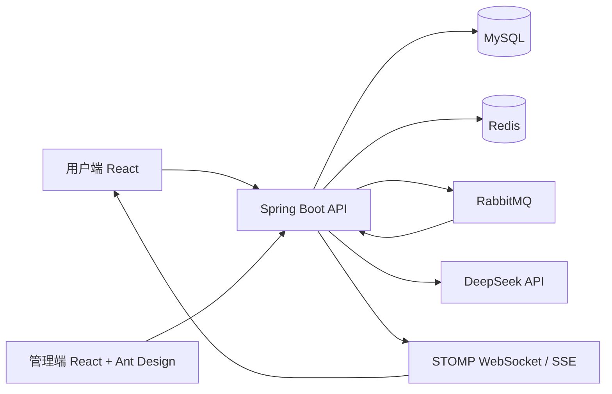

# EventHub

EventHub 是一个面向城市活动场景的全流程票务平台，覆盖活动发布与审核、在线选座、订单支付、异步出票、动态电子票、现场核销、站内通知和 AI 活动助手。

项目采用前后端分离架构，由用户端、运营管理端和 Spring Boot 后端组成。MySQL 保存业务事实，Redis 负责会话、缓存与临时锁，RabbitMQ 承担订单超时和异步出票等可靠消息处理。

当前稳定约束版本：`0.7.0`。

## 核心能力

### 用户端

- 浏览、搜索和筛选已发布活动
- 查看活动、场次、场馆和票档详情
- 固定座位选座与无座票档库存锁定
- 创建订单、模拟支付、取消订单和查询订单状态
- 查看电子票、票券状态和短时动态二维码
- 接收支付、取消、超时和出票站内通知
- 收藏感兴趣的活动并管理个人收藏
- 在真实购票场次开始后发布活动评分与评价
- 通过 AI 助手获取活动建议并查询本人订单、票券状态

匿名访客可以浏览活动并查看 AI 助手入口；AI 对话、订单和票券查询需要登录。

### 商家端

- 创建和维护场馆、固定座位及座位等级
- 创建活动、场次和票档并提交平台审核
- 更新已发布活动的封面、简介和详情
- 查询所属商家的订单
- 查看所属商家的成交、出票、核销和热门活动统计
- 扫码或输入票码预览、核销票券
- 查看首次及重复核销记录

### 平台管理端

- 管理商家及商家状态
- 审核、驳回、下架活动
- 查看平台活动和订单概览
- 查询全平台订单
- 查询票券核销审计记录
- 查看全平台成交趋势、热门活动与履约指标
- 治理违规活动评价并查询关键管理操作审计

## 业务流程

```text
商家创建场馆和活动
        ↓
配置场次、票档与固定座位
        ↓
提交平台审核
        ↓
管理员审核发布
        ↓
用户浏览活动并锁定座位或库存
        ↓
创建订单并完成模拟支付
        ↓
RabbitMQ 异步生成电子票
        ↓
用户展示动态二维码
        ↓
商家现场核销并保留审计记录
```

订单状态变化会同步创建站内通知。WebSocket 负责及时提醒，HTTP 查询和 MySQL 数据仍是断线恢复与最终状态的可信来源。

## 技术架构



### 后端

- Java 21
- Spring Boot 3.5
- Spring Security + JWT + Refresh Token 轮换
- MyBatis
- Flyway
- MySQL 8.4
- Redis 7.4
- RabbitMQ 4.1
- STOMP WebSocket
- SSE 流式响应
- Springdoc OpenAPI

### 前端

- React 19
- TypeScript 6
- Vite 8
- React Router
- TanStack Query
- Zustand
- Axios
- 用户端原生品牌化界面
- 管理端 Ant Design

## 工程结构

```text
EventHub/
├── eventhub-server/    Spring Boot 后端、Flyway 迁移和后端测试
├── eventhub-web/       用户端 React 应用，默认端口 3000
├── eventhub-admin/     商家与平台管理端，默认端口 3001
├── docs/               架构约束、版本记录和阶段设计文档
├── scripts/            本地验收与并发测试脚本
├── compose.yaml        MySQL、Redis、RabbitMQ 本地基础设施
└── .env.example        Docker Compose 与公共配置示例
```

后端业务按领域和职责拆分。Controller 只处理 HTTP 协议和参数校验，状态转换由领域规则维护，MyBatis Mapper 按命令、查询和子领域组织。

前端按 Page、Feature、Entity 和 Shared 分层。服务端状态使用 TanStack Query，认证状态使用 Zustand，OpenAPI 生成目录不手工修改。

## 快速开始

### 环境要求

- JDK 21
- Node.js 24
- npm 11
- Docker Desktop 或兼容的 Docker Compose 环境

### 1. 启动基础设施

在仓库根目录执行：

```powershell
docker compose up -d
docker compose ps
```

默认启动：

| 服务 | 地址或端口 |
| --- | --- |
| MySQL | `localhost:3307` |
| Redis | `localhost:6379` |
| RabbitMQ | `localhost:5672` |
| RabbitMQ 管理端 | http://localhost:15672 |

MySQL 默认映射到宿主机 `3307`，避免与本机已有的 `3306` 冲突。Docker Compose 会自动读取仓库根目录的 `.env`；可以从 `.env.example` 创建本地配置，真实 `.env` 不应提交。

### 2. 配置后端密钥

Spring Boot 不会自动读取仓库根目录的 `.env`。请在启动后端的 PowerShell 会话或 IDE Run Configuration 中设置环境变量：

```powershell
$env:AUTH_JWT_SECRET = '请替换为至少 32 位的随机字符串'
$env:TICKET_QR_SECRET = '请替换为独立的至少 32 位随机字符串'
```

需要初始化本地管理员和商家时，可额外设置：

```powershell
$env:BOOTSTRAP_ADMIN_USERNAME = 'admin'
$env:BOOTSTRAP_ADMIN_PASSWORD = '请替换为本地强密码'
$env:BOOTSTRAP_MERCHANT_USERNAME = 'merchant'
$env:BOOTSTRAP_MERCHANT_PASSWORD = '请替换为本地强密码'
$env:BOOTSTRAP_MERCHANT_NAME = '本地演示商家'
```

这些账号只会在不存在时创建。密码不会写入仓库或应用日志。

### 3. 启动后端

```powershell
cd eventhub-server
.\mvnw.cmd spring-boot:run
```

Flyway 会在启动时自动执行数据库迁移。

### 4. 启动用户端

```powershell
cd eventhub-web
npm install
npm run dev
```

### 5. 启动管理端

```powershell
cd eventhub-admin
npm install
npm run dev
```

## 本地地址

| 应用 | 地址 |
| --- | --- |
| 用户端 | http://localhost:3000 |
| 管理端 | http://localhost:3001 |
| 后端健康检查 | http://localhost:8080/actuator/health |
| OpenAPI | http://localhost:8080/v3/api-docs |
| Swagger UI | http://localhost:8080/swagger-ui.html |
| RabbitMQ 管理端 | http://localhost:15672 |

常用页面：

- 用户活动列表：http://localhost:3000/activities
- 用户订单：http://localhost:3000/orders
- 用户票券：http://localhost:3000/tickets
- 用户通知：http://localhost:3000/notifications
- 用户收藏：http://localhost:3000/favorites
- 管理端活动：http://localhost:3001/activities
- 管理端订单：http://localhost:3001/orders
- 管理端核销：http://localhost:3001/verification
- 管理端场馆：http://localhost:3001/venues
- 管理端商家：http://localhost:3001/merchants
- 管理端操作审计：http://localhost:3001/audit

## AI 智能助手

用户端右下角提供 EventHub AI 智能助手。助手通过 DeepSeek OpenAI 兼容接口进行流式对话，支持：

- 根据城市、日期、分类和预算推荐站内真实活动
- 查询活动可售场次并提供站内跳转入口
- 查询当前用户最近已支付订单
- 查询当前用户订单票券和待使用票券
- 提供活动、场次、订单和票券资源卡片

助手采用后端受控 Tool Calls。模型不能直接访问数据库或任意接口，也不能创建订单、支付、取消或核销票券。订单和票券工具始终使用当前认证用户 ID 校验归属。

启用助手前，在后端启动环境中配置：

```powershell
$env:DEEPSEEK_API_KEY = '你的本机 DeepSeek Key'
$env:DEEPSEEK_BASE_URL = 'https://api.deepseek.com'
$env:DEEPSEEK_MODEL = 'deepseek-v4-flash'
```

Key 只能存在于后端环境变量中，不得进入前端、数据库、日志或 Git。未配置时，助手接口返回 `AI_NOT_CONFIGURED`。

## 可靠性设计

### 收藏、评价与运营

- 收藏使用 `(user_id, activity_id)` 唯一约束保证幂等
- 只有本人存在已支付订单且对应场次已经开始时才能评价
- 每个用户对同一活动最多保留一条评价
- 被管理员隐藏的评价不参与公开列表和评分聚合，只有管理员可以恢复
- 商家统计始终使用当前商家 ID 限制数据范围
- 运营统计基于 MySQL 已支付订单和票券事实，不依赖 Redis 临时状态
- 关键管理操作在业务事务内写入脱敏审计记录

### 座位与库存

- Redis Lua 原子锁定固定座位和无座票库存
- MySQL 条件更新与唯一约束负责最终防重
- Redis 临时锁不是最终售出依据
- 订单取消或过期后恢复库存和固定座位
- `Idempotency-Key` 与数据库记录共同保证写请求幂等

### 订单与异步出票

- 订单创建和支付在业务事务内写入 Outbox
- Outbox 使用 RabbitMQ Publisher Confirm 可靠投递
- 未支付订单通过 TTL 和死信队列触发超时关闭
- 数据库定时扫描作为消息延迟或不可用时的兜底
- 消费记录和数据库唯一约束保证至少一次投递下的幂等
- 支付成功后异步生成一人一票的电子票

### 票券与核销

- 票号使用不可预测随机值
- 动态二维码使用独立 HMAC 密钥并默认 60 秒过期
- 首次核销使用 MySQL 条件更新保证原子性
- 重复核销不会改变票券状态，但会保留审计记录
- 商家只能预览和核销所属商家的票券

### 认证与权限

- Access Token 为短期 JWT，仅保存在前端内存
- Refresh Token 使用 HttpOnly Cookie
- Redis 只保存 Refresh Token 摘要
- Refresh Token 每次使用后轮换，退出时撤销
- 用户端与管理端使用独立客户端类型和 Cookie
- Refresh 和 Logout 同时校验 CSRF 请求头与 Cookie

## OpenAPI 客户端

后端运行后，在两个前端工程中分别执行：

```powershell
npm run api:generate
```

生成代码位于：

```text
src/shared/api/generated
```

生成目录禁止手工修改。公开或重要接口应在后端声明稳定的 `operationId`，避免客户端函数名随接口顺序变化。

## 测试与检查

后端：

```powershell
cd eventhub-server
.\mvnw.cmd clean verify
```

用户端：

```powershell
cd eventhub-web
npm run check
```

管理端：

```powershell
cd eventhub-admin
npm run check
```

固定座位并发验收：

```powershell
.\scripts\test-seat-lock-concurrency.ps1 `
  -AccessToken '<用户 Access Token>' `
  -SessionId 1 `
  -TicketTypeId 1 `
  -SessionSeatId 2 `
  -Requests 100
```

## 媒体文件

商家可以上传 JPG 或 PNG 活动封面。系统限制单张图片最大 5 MB、尺寸最大 `6000 × 6000`，服务端会验证真实图片内容并生成随机文件名。

开发环境默认存储目录：

```text
eventhub-server/.data/uploads/activity-covers
```

可以通过 `UPLOAD_ROOT` 修改目录。运行时上传文件位于 Git 忽略的 `.data/` 中；生产环境可以替换为对象存储。

## 文档

- [架构与接口约束](docs/architecture-interface-requirements.md)
- [版本管理](docs/version-management.md)
- [AI 智能助手设计](docs/2026-06-12_AI智能助手.md)
- [票券核销与站内通知设计](docs/2026-06-12_票券核销与站内通知.md)

涉及公共 API、数据库结构、安全边界或跨模块架构的改动，应先阅读 `AGENTS.md` 和相关设计文档。

## 安全说明

- 不提交 `.env`、密码、Token、DeepSeek Key、JWT 密钥或二维码签名密钥
- 不在日志中输出认证请求体、完整请求头或业务凭证
- JWT 密钥和票券二维码 HMAC 密钥必须相互独立
- 生产环境必须启用安全 Cookie、HTTPS 和独立的生产凭据
- 本地 Docker 默认密码只用于开发环境，不得用于生产部署
